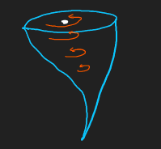
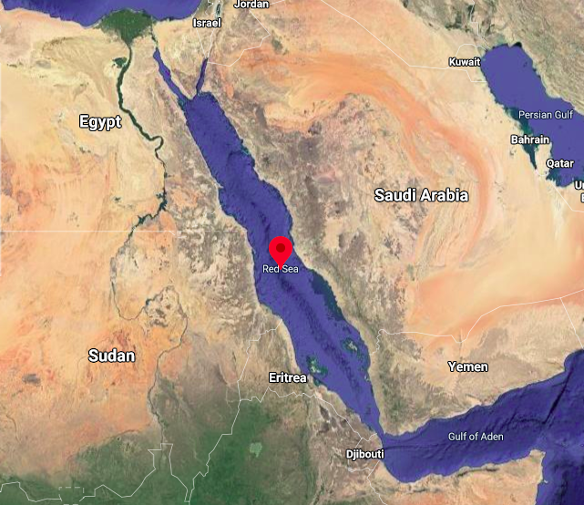
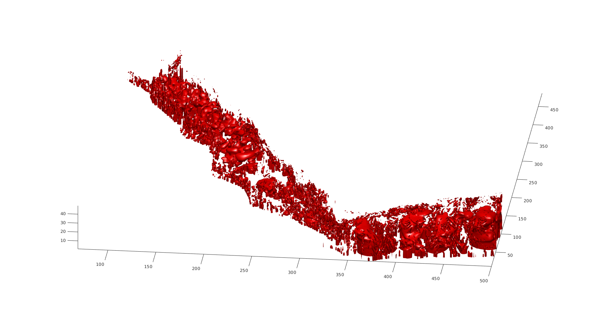
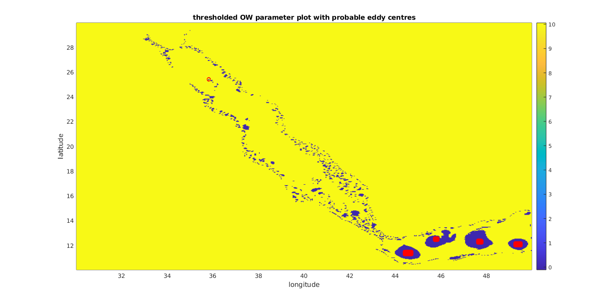
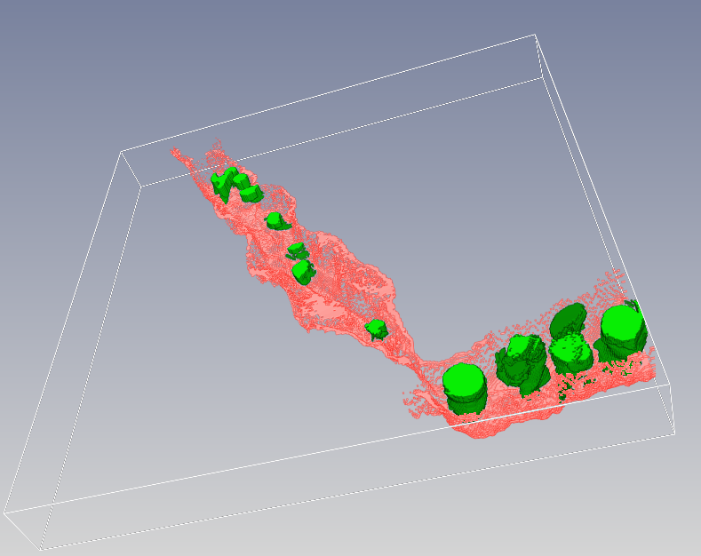
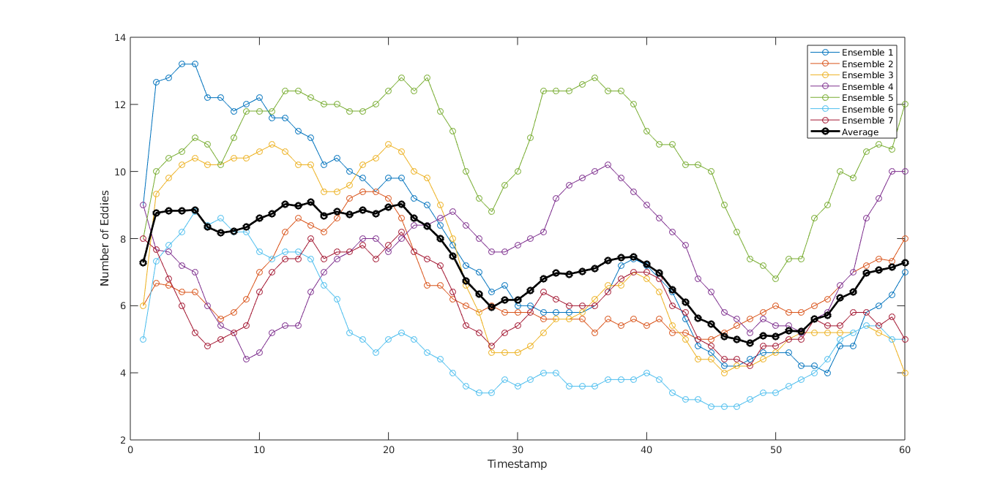
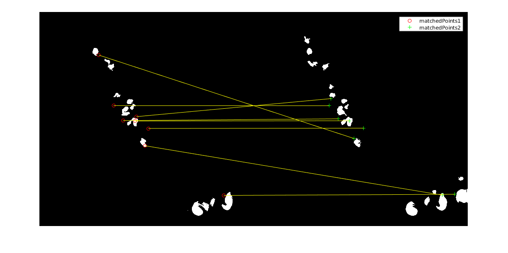
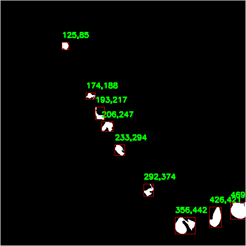
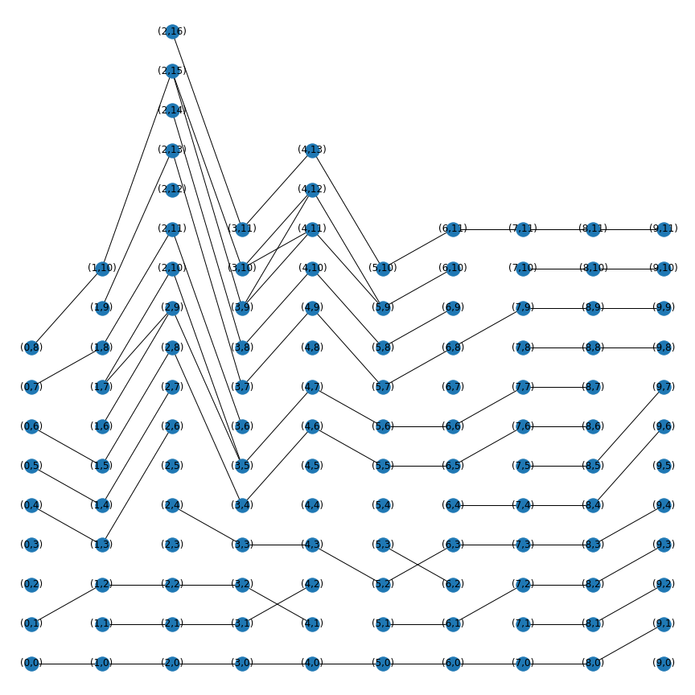
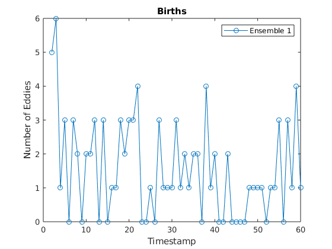

<p align="center">
  <a href="" rel="noopener">
 </a>

<h1 align="center">Eddy-Analyser</h1>
<h3 align="center">Real-Time Eddy Visualisation and Analysis.</h3>


- **Eddies** are clockwise or counter-clockwise circular movements of water that play a major role in transporting energy and biogeochemical particles in the ocean.
<p align="center">
  <a href="" rel="noopener">
 </a>


<p align="center"> NASA Visualisation Studio</p>

------------------------------------------
This project does visualization of eddies present in red sea and finds interesting statistical measures to study behavior of eddies.

- Given the narrow nature of the basin, many eddies can occupy more than half of the Red Sea width, providing rapid transport of organisms and nutrients along the coastline and between the african and Arabian Peninsula coasts. 
- These marine `whirlpools` are much more frequent than what had been previously thought, profoundly affecting the social and economic lives of people living in the surrounding countries.


<p align="center">
<a href="" rel="noopener">
</a>

<div style="text-align: center">Red Sea - Google Maps</div>

- This is a course project of [Graphics and Visualization](https://www.csa.iisc.ac.in/~vijayn/courses/Graphics/index.html) course.
- Problem statement for this project is taken from [IEEE SciVis Contest 2020](https://kaust-vislab.github.io/SciVis2020/index.html)
- This project solves `Eddy Visualization in 3D ` and `Interesting Eddy statistics`  tasks of contest. It tracks eddies over multiple time intervals and derive important statistics like births/deaths or path of eddies.
  
------------------------------------------
## Contributors:
- [@Kadam-Tushar](https://github.com/Kadam-Tushar)
- [@TanayNarshana](https://github.com/TanayNarshana)

------------------------------------------

## Red Sea Dataset: 
[Ensembled](https://kaust-vislab.github.io/SciVis2020/data.html) data of red sea is provided on contest webpage.

------------------------------------------

## Visualisations Softwares / Dependencies : 
- [Inviwo](https://github.com/inviwo/inviwo) - Open Source Scientific Visualization tool.
- `Matlab` for fast Data processing.
- Visualization libraries like `py-plot`,`networkx`.
- Data processing libraries in matlab/python like pandas.
- `OpenCV` for Image Processing. 
  

## Brief Explanation of our Approach:

- Detected meso-scale eddies using [Okuba-weiss parameter](https://github.com/inviwo/inviwo) from `velocity field` in  dataset.
<p align="center">
<a href="" rel="noopener">
</a>
<p align="center">3D Eddy Visualisations</p>  
<br>
   
- Filtered out `false postitive` eddies using Gemotrical constraints mentioned in this [paper](https://www.researchgate.net/publication/260722486_Gulf_Stream_eddy_characteristics_in_a_high-resolution_ocean_model_Gulf_Stream_Eddy_Characteristics).
<p align="center">
<a href="" rel="noopener">
</a>
<p align="center">Surface Level Meso-scale Eddies</p>  
<br>

- Applied `Bredth First Search` algorithm on detected eddy centers from above step  over 3D region till threshhold value of Okuba-weiss parameter is reached.
- Generated possible regions of Eddies in 3D space and then this new data is visualized using `Inviwo` tool.
 
 Here in Inviwo we can interactivly study shapes of these eddies in 3D. 

 ```
Green : Eddies.
Pink : Sea Bed from Bathy metry data.
 ```

<p align="center">
<a href="" rel="noopener">
</a>
<p align="center">3D Eddy Visualisations with Bathymetry Data at Timestep 15</p>  

<br>

- Calculating this eddy information over all ensembles we plotted count of eddies graph.

<p align="center">
<a href="" rel="noopener">
</a>

<p align="center">Eddy Count over 7 ensembles</p>
<br>

- To validate our detected eddies we tried `stream-line-plots` over same regions:
 
<p align="center">
<a href="" rel="noopener">


</a>
<p align="center">Streamlines and eddy detection on same graph</p>
<br>

- To establish relationship between eddies i.e identify  particular eddy is same in timestep X and X+1 we developed algorithm (see report for details) for eddy-tracking using area - overlap method. 
Also tried  matlab's `SURF` feature to identify same eddies over different time interval:
<p align="center">
<a href="" rel="noopener">
  </a>

<p align="center">SURF from matlab</p>

<br>


- To make this anaylysis as real time as posible we used `Image Processing` to track eddies between images of surface eddies.

<p align="center">
<a href="" rel="noopener">
</a>
<p align="center">Eddy Detection from images and their centroids </p>
<br>

- Applied object detection algorithms on images of eddies using `Contour Detection`​.For each detected objects we can assign features like centroid of eddy, shape of contours, area of contours, After that  we can search for eddies with same features in next few timesteps.
- Once tracking is done from previous step now to Visualise eddy-relationships we tried to show it graph format as below. 
  
<p align="center">
<a href="" rel="noopener">
</a>
<p align="center">Eddy Life Graph </p>
Each Column of nodes represents eddies from that timestep and edge between node represents these two eddies are same,just images  at different timestep.
<br>
<br>

- From this network we visualised Deaths/Births graph and splits/merges of eddies.
  
<p align="center">
<a href="" rel="noopener">
</a>
<p align="center"> Eddy Births</p>

----
- PR's are welcome, 
- Detailed [ Report](./Report.pdf) of Work.
- [PPT](https://indianinstituteofscience-my.sharepoint.com/:p:/g/personal/tanayn_iisc_ac_in/EVK5ONb0xZxPhPe2M9f-Kk0Bxvx2NOX_0W1nUUdQd0rmXQ?e=XhJACi) for better understadning.
